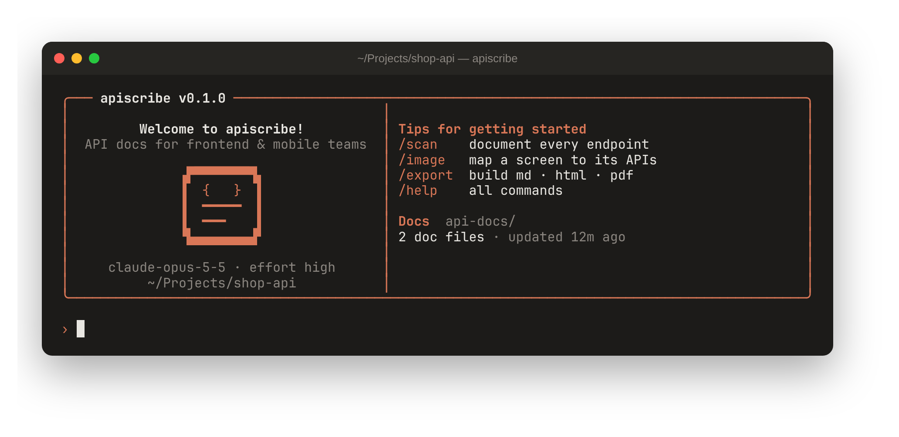

# apiscribe

<p align="center">
  
</p>

An AI CLI built on Claude that writes API documentation for **frontend and mobile developers**. Run it in your backend repo and it reads the code (routes, controllers, DTOs, validators, middleware, error handlers), then writes docs that show every endpoint's expected request, its responses, and its errors. Give it a screenshot of an app screen and it tells you which APIs that screen should call.

```
› /scan
∴ Express app; routes mounted in src/app.js under /api/v1…
● Search("router\.(get|post|put|patch|delete)")
  ⎿  14 matches
● Read(src/routes/cart.js)
  ⎿  31 lines
● Write(endpoints/cart.md)
  ⎿  created · 212 lines
Documented 14 endpoints in 5 files. ⚠️ POST /auth/login has no rate limiting.

› /image ~/Downloads/checkout.png -- this is the checkout screen
› /export
✓ api-docs/dist/API_DOCUMENTATION.md
✓ api-docs/dist/API_DOCUMENTATION.html
✓ api-docs/dist/API_DOCUMENTATION.pdf
```

> **Also available in Go and Rust.** The same tool ships as a single native binary, with no Node.js needed, in [apiscribe-go](https://github.com/abdullahazmy/apiscribe-go) and [apiscribe-rs](https://github.com/abdullahazmy/apiscribe-rs). All three versions use the same prompts and commands and produce the same output. Prebuilt binaries for Linux, macOS, and Windows are on each repo's Releases page.

## Install

```bash
npm install
npm run build
npm link            # puts `apiscribe` on your PATH
```

Authentication works the same way as the Anthropic SDK: set `ANTHROPIC_API_KEY`, or run `ant auth login` once.

PDF export uses an installed Chrome, Chromium, or Edge. It finds the common install locations on its own; to point it at a different binary, set `APISCRIBE_CHROME=/path/to/chrome`.

## Usage

### Interactive (like Claude Code)

```bash
cd my-backend
apiscribe
```

| Command | What it does |
|---|---|
| `/scan [focus]` | Finds every endpoint and writes `README.md` plus `endpoints/<resource>.md`. Run it again to update the docs. |
| `/endpoint <what>` | Documents or updates one endpoint, e.g. `/endpoint POST /api/orders` |
| `/image [paths…] [-- note]` | Maps app screens to the APIs they should call. With no path it reads the image from the clipboard. You can also drag an image file into the terminal. |
| `/export [md\|html\|pdf\|all]` | Builds single-file `API_DOCUMENTATION.md`, `.html`, and `.pdf` files in `api-docs/dist/` |
| `/docs` | Lists the generated files |
| `/effort [level]` | Sets reasoning effort: `low`, `medium`, `high` (default), `xhigh`, or `max` |
| `/cost` | Shows token usage and estimated cost |
| `/clear` | Starts a new conversation. Docs on disk are kept. |

Anything else you type goes to Claude as a chat message, for example "add Arabic error messages to the auth docs" or "which endpoints need auth?". Press ctrl+c to interrupt the current response. Press ctrl+c twice, or ctrl+d, to exit.

### One-shot (scripts and CI)

```bash
apiscribe generate                      # scan, then export md + html + pdf
apiscribe generate "only the payments module" --format html
apiscribe image login.png home.png -n "customer mobile app"
apiscribe endpoint "POST /api/v1/cart/items"
apiscribe export --format pdf           # render only, no AI calls
apiscribe -C ../other-service -o docs/api generate
```

Global options: `-C/--project <dir>`, `-o/--docs-dir <dir>` (default `api-docs`), `-m/--model` (default `claude-opus-5-5`), and `-e/--effort`. You can also set them through the environment variables `APISCRIBE_MODEL`, `APISCRIBE_EFFORT`, and `APISCRIBE_DOCS_DIR`.

## What the docs contain

For each endpoint:

- auth requirements
- headers
- tables of path, query, and body parameters, with types, constraints, and defaults
- a curl example
- every response status, each with a realistic JSON example that matches the real serializer
- TypeScript types
- client notes covering pagination, retries, rate limits, and side effects

`README.md` covers authentication, the error format, conventions, and an index of all endpoints.

Each screen mapping (`screens/<name>.md`) lists:

- which calls to make when the screen loads, and their order
- which endpoint each UI action calls
- which response field fills each UI element
- loading, empty, and error states
- **missing APIs**: things the screen needs that the backend doesn't provide yet

## How it works

- `src/agent.ts` is a streaming tool-use loop on the Claude API. It uses Claude Opus 5.5 with adaptive thinking. Progress notes are shown between tool calls, prompt caching is on, and server-side refusal fallback is enabled (`fallbacks: "default"`). The history is append-only, so the cache stays warm.
- `src/tools.ts` defines the tools: `list_files`, `read_file`, and `search` (ripgrep, with a JS fallback) can only read inside the project. `write_doc` can only write `.md/.json/.yaml` files inside the docs directory.
- `src/image.ts` loads images from a file path or the clipboard. It supports Wayland (`wl-paste`), X11 (`xclip`), macOS, and Windows.
- `src/export.ts` merges the docs and rewrites links between files. It renders a self-contained HTML page with a searchable sidebar, method badges, and light/dark themes, then prints a PDF with puppeteer-core.
